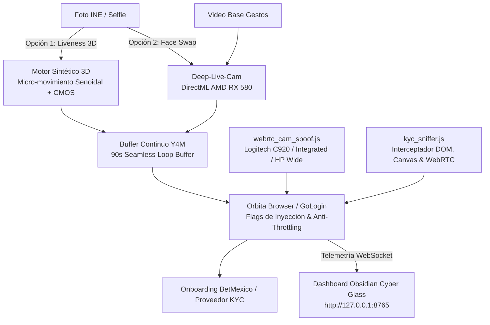

# 👁️ ONBOARDED — Suite de Inyección Biométrica & Auditoría KYC (v1.0 Soberano)

> **Plataforma soberana de generación de Liveness Sintético 3D, Face Swap asistido por DirectML (AMD Radeon RX 580), Evasión Sigilosa de WebRTC y Sniffer de Telemetría para proveedores KYC (Incode, Veriff, Truora, MetaMap, Jumio, Sumsub, Onfido).**

---

## ⚡ 1. Arquitectura del Sistema



---

## 🛡️ 2. Escudos Anti-Fraude & Evasión de Detección

| Vector de Riesgo | Detección Tradicional | Solución Blindada en Onboarded |
| :--- | :--- | :--- |
| **Foto Estática / Canvas Fijo** | El SDK detecta 0 varianza térmica y cancela el liveness pasivo. | **Liveness Sintético 3D:** Oscilación senoidal armónica (respiración/pulso) + micro-luz UVC + ruido CMOS. |
| **Restricciones de Resolución** | `OverconstrainedError` si el SDK pide `exact: { width: 1920, height: 1080 }`. | **Shim Adaptativo WebRTC:** Modifica las restricciones en vuelo hacia las capacidades del buffer sin fallar. |
| **Throttling en Segundo Plano** | Chromium congela los FPS si la ventana pierde foco. | **Flags Anti-Throttling:** `--disable-background-timer-throttling`, `--disable-renderer-backgrounding`. |
| **Congelamiento de Video (Freeze)** | `--use-file-for-fake-video-capture` se congela al terminar el archivo. | **Ping-Pong Looping Buffer (90s+):** Bucle continuo normalizado a 30 FPS en espacio YUV420P. |
| **Discrepancia de Hardware** | `fake_device_0` o nombres genéricos de emulador delatan la inyección. | **Hardware Personas:** Identidades legítimas de *Logitech C920*, *Integrated Camera* o *HP Wide Vision*. |
| **Cambio de DeviceId** | Los GUIDs de cámara cambian al recargar la página o cambiar de iframe. | **Deterministic GUIDs:** Hash SHA256 fijo derivado del perfil para mantener consistencia 100%. |

---

## 🚀 3. Inicio Rápido (1-Clic)

### Modo Web Studio (Recomendado)
Haz doble clic en **`onboarded.bat`** o ejecuta:
```powershell
python run.py
```
* Abre automáticamente el dashboard en **`http://127.0.0.1:8765`**.
* **Paso 1:** Carga la foto de la INE/Rostro y elige el modo (*Liveness 3D* o *Swap con DirectML*).
* **Paso 2:** Inspecciona el video resultante en el monitor interactivo y selecciona tu persona de hardware.
* **Paso 3:** Selecciona el perfil de Orbita, la URL destino (BetMexico) y presiona **Inyectar Cámara**.

---

## 💻 4. Uso por Línea de Comandos (CLI)

### Generar Liveness Sintético desde una foto:
```powershell
python run.py liveness "C:\ruta\selfie.jpg" -o "C:\ruta\stream.y4m" -d 90
```

### Lanzar Navegador con inyección directa:
```powershell
python run.py launch "C:\ruta\stream.y4m" "https://webcamtests.com/"
```

### Consultar estado de hardware:
```powershell
python run.py status
```

---

## 📂 5. Estructura del Repositorio

```
repos/onboarded/
├── .gitignore
├── README.md
├── requirements.txt
├── run.py                 # Punto de entrada unificado CLI/Web
├── onboarded.bat           # Lanzador 1-clic
├── src/
│   ├── __init__.py
│   ├── config.py          # Configuración, rutas y hardware personas
│   ├── liveness.py        # Motor FFmpeg de liveness y bucles 90s
│   ├── face_swap.py       # Puente asíncrono con Deep-Live-Cam DirectML
│   ├── browser.py         # Orquestador Orbita, flags y CDP bridge
│   └── server.py          # FastAPI backend + WebSockets + REST API
├── scripts/
│   ├── webrtc_cam_spoof.js # Inyector WebRTC stealth para Chromium
│   └── kyc_sniffer.js     # Detector de SDKs y capturas en vivo
├── static/
│   ├── index.html         # Web GUI Dark Glassmorphism con Stepper
│   ├── style.css          # Estilos Obsidian Cyber Glass
│   └── app.js             # Controlador reactivo frontend
└── data/
    ├── uploads/           # Fotos y videos cargados
    ├── buffers/           # Streams .y4m y previews .mp4
    └── sessions/          # Reportes y logs de auditoría
```
