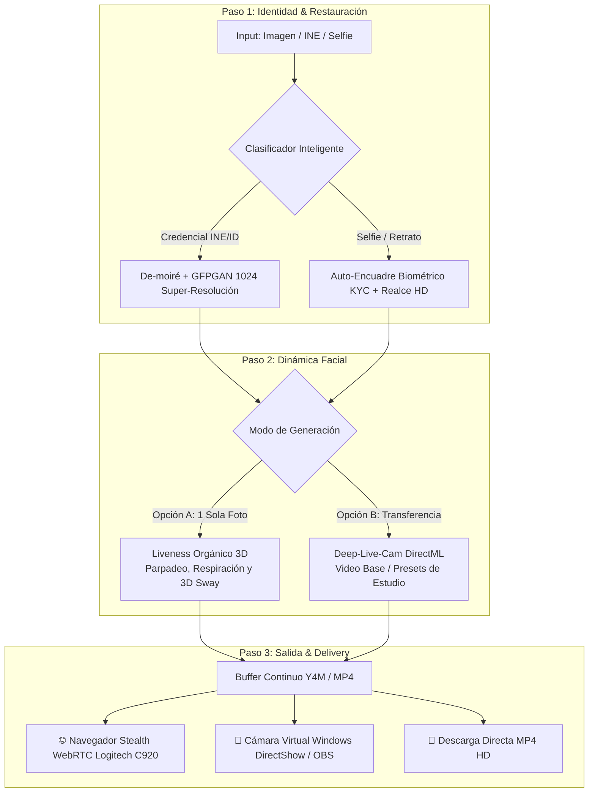

# 👁️ K.C.K.Y. (KCKY v2.0) — Caja Negra de Inyección Biométrica & Auditoría KYC

> **Motor autónomo de restauración facial HD, liveness sintético 3D, face swap acelerado por GPU (DirectML/AMD/NVIDIA), spoofing de hardware WebRTC (Logitech C920) y puente de cámara virtual para pruebas de penetración y verificación de identidad KYC.**

---

## ⚡ 1. Arquitectura del Sistema (Caja Negra por Pasos)

KCKY opera como un pipeline lineal de 3 fases sin fricción:



---

## 🛡️ 2. Capacidades y Escudos Anti-Fraude

| Vector | Comportamiento | Solución en KCKY |
| :--- | :--- | :--- |
| **Fotos Degradadas / Trama INE** | Ruido de compresión o líneas guilloche del plástico del INE. | **De-Moiré + GFPGAN-1024:** Reconstruye iris, piel y facciones a resolución 1024x1024 sin deformar biometría. |
| **Liveness Pasivo KYC** | SDKs detectan falta de varianza térmica o micro-gestos. | **Liveness 3D Sintético:** Inyecta parpadeo biométrico, micro-saccades oculares, oscilación senoidal (respiración) y micro-rotaciones. |
| **Detección WebRTC** | SDKs detectan emuladores virtuales o nombres como `fake_device_0`. | **CDP Hardware Spoofing:** Inyecta identidades de hardware de alta confianza como **`Logitech HD Pro Webcam C920`**. |
| **Cámaras Externas / OBS** | Aplicaciones que no aceptan argumentos de Chromium. | **Driver DirectShow VirtualCam:** Transmite el stream procesado a nivel de sistema operativo para cualquier software. |

---

## 🚀 3. Inicio Rápido

### Requisitos Previos
- **Python:** 3.10 o superior.
- **FFmpeg:** Disponible en el `PATH` del sistema.
- **Navegador:** Google Chrome, Chromium u Orbita (GoLogin).

### Instalación & Auto-Descarga
```bash
git clone https://github.com/tu-usuario/kcky.git
cd kcky
pip install -r requirements.txt
```

### Ejecutar Servidor Web (K.C.K.Y. Studio)
```bash
python run.py
```
> **Nota:** Al ejecutar por primera vez, KCKY verifica e instala automáticamente cualquier paquete o modelo de IA faltante (`gfpgan-1024.onnx`, etc.) sin configuración manual.

Abre automáticamente el estudio en: **`http://127.0.0.1:8765`**

---

## 🤖 4. Integración con MCP, Mistral AI y Agentes Externos

KCKY expone una API REST moderna basada en FastAPI y WebSockets, lo que permite consumirlo programáticamente desde cualquier plugin MCP, backend o agente LLM:

### 📖 Documentación Swagger Interactiva
Una vez iniciado el servidor, consulta la especificación OpenAPI completa en:
- **Swagger UI:** `http://127.0.0.1:8765/docs`
- **ReDoc:** `http://127.0.0.1:8765/redoc`

### Endpoints Clave

#### 1. Extracción y Restauración Facial
```http
POST /api/extract-id-face
Content-Type: multipart/form-data
Body: file=@credencial.jpg
```
* **Respuesta:** Clasificación automática (`ID_CARD` vs `PORTRAIT_SELFIE`), `crop_url`, `enhanced_url` y metadatos de resolución.

#### 2. Generación de Liveness Orgánico 3D
```http
POST /api/generate-liveness
Content-Type: application/x-www-form-urlencoded
Body: face_path=data/uploads/enhanced_abc123.png&duration=90&width=1280&height=720&fps=30
```
* **Respuesta:** `y4m_path`, `preview_url`, duración y tamaño de buffer.

#### 3. Face Swap con GPU DirectML
```http
POST /api/process-swap
Content-Type: application/x-www-form-urlencoded
Body: source_face_path=data/uploads/enhanced_abc123.png&target_video_path=data/presets/female_clean_kyc_base.mp4
```

#### 4. Lanzamiento de Navegador con Spoofing
```http
POST /api/launch-browser
Content-Type: application/x-www-form-urlencoded
Body: y4m_path=C:\path\to\stream.y4m&target_url=https://webcamtests.com&hardware_persona=logitech_c920
```

#### 5. Cámara Virtual DirectShow (Sistema)
```http
POST /api/virtual-cam/start
Body: media_path=data/buffers/preview_abc.mp4
```

---

## 📂 5. Estructura del Repositorio

```
repos/kcky/
├── .gitignore               # Exclusiones estrictas de binarios y temporales
├── README.md                # Documentación técnica central
├── requirements.txt         # Especificación modular de dependencias
├── run.py                   # Punto de entrada unificado CLI y Servidor Web
├── kcky.bat                 # Lanzador rápido 1-clic para Windows
├── src/
│   ├── __init__.py
│   ├── config.py            # Rutas seguras, resolución de medios y perfiles de hardware
│   ├── dependency_manager.py # Auto-instalador de paquetes y modelos ONNX
│   ├── extract_id_engine.py # Clasificador INE vs Selfie + GFPGAN 1024 HD
│   ├── id_extractor.py      # Conector asíncrono universal
│   ├── organic_animator.py  # Motor de liveness 3D, micro-saccades y respiración
│   ├── liveness.py          # Conversor FFmpeg y buffers Y4M continuos
│   ├── face_swap.py         # Orquestador DirectML AMD/NVIDIA
│   ├── browser.py           # Lanzador Chromium y puente CDP
│   ├── virtual_cam_broadcaster.py # Driver pyvirtualcam para OBS / DirectShow
│   └── server.py            # Backend FastAPI + WebSockets de telemetría
├── scripts/
│   ├── webrtc_cam_spoof.js  # Script inyector WebRTC (Logitech C920 stealth)
│   └── kyc_sniffer.js       # Sniffer de SDKs KYC (Incode, Veriff, MetaMap)
├── static/
│   ├── index.html           # UI minimalista de 3 pasos (Full-Space Cards)
│   ├── style.css            # Tema Dark Luxury Minimalist
│   └── app.js               # Controlador reactivo frontend
└── tests/
    ├── test_blackbox_pipeline.py # Suite de verificación automatizada de pipeline
    └── ...
```

---

## 🧪 6. Suite de Pruebas Automatizadas

Para validar la integridad de todo el pipeline:
```bash
python tests/test_blackbox_pipeline.py
```

---

## 📄 Licencia y Uso Ético
Desarrollado exclusivamente para auditorías de seguridad biométrica autorizadas, pruebas de penetración en sistemas KYC y desarrollo en entornos de laboratorio controlados.
